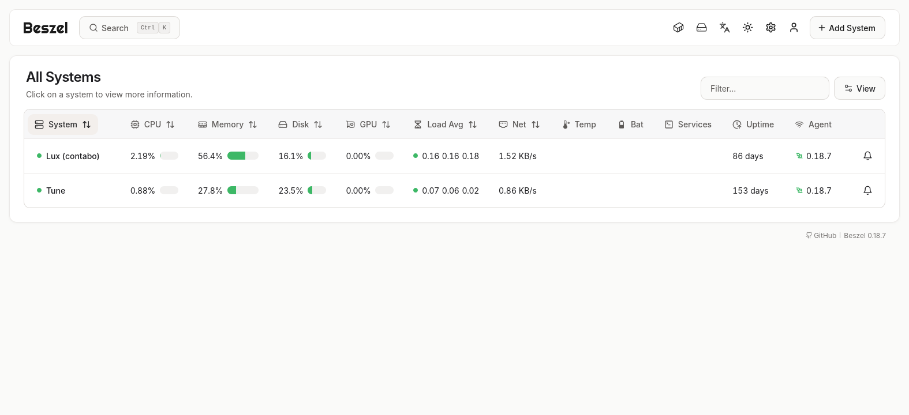
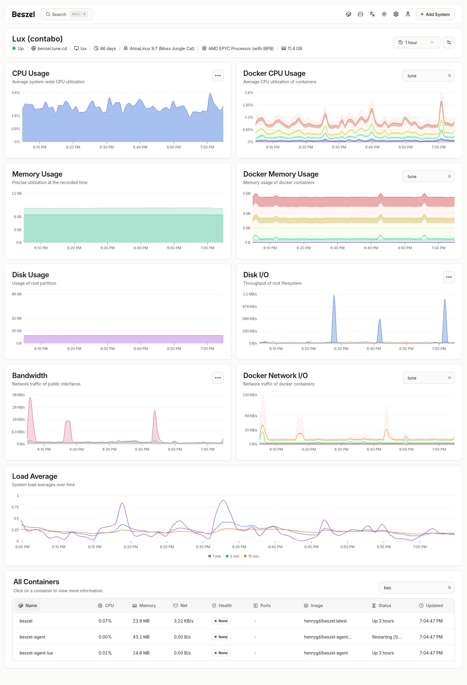
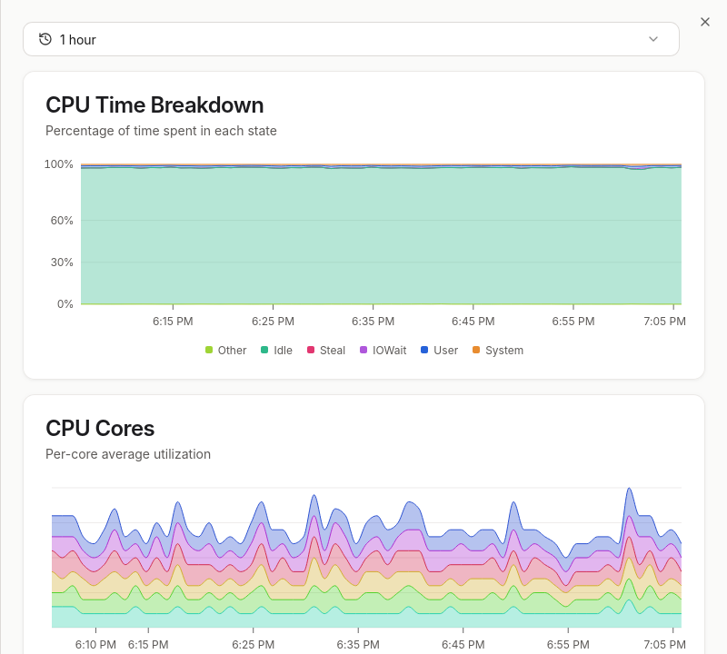

# Beszel Monitoring Stack

This stack deploys **Beszel** (a lightweight monitoring hub) and its **Agent**, both running via **Docker Compose** and managed behind a **Traefik** reverse proxy.

## 📸 Screenshots

### Home — Systems list

<picture>
  <source media="(prefers-color-scheme: dark)" srcset="screenshots/a2.png">
  
</picture>

### System dashboard

<picture>
  <source media="(prefers-color-scheme: dark)" srcset="screenshots/b2.png">
  
</picture>

### CPU detail

<picture>
  <source media="(prefers-color-scheme: dark)" srcset="screenshots/c2.png">
  
</picture>

---

## 🛠 Prerequisites

Before running this stack, make sure you have:

- **Docker Compose** installed on your machine.
- The **Traefik** proxy deployed and actively running on the `traefik_proxy` network.  
  Required repository: [https://github.com/jeremylanes/traefik](https://github.com/jeremylanes/traefik)

## ⚙️ Configuration

Create an `.env` file at the root of this folder with the following variables:

```env
# Required for the main stack (docker-compose.yml)
DOMAIN_NAME=beszel.example.com

# Required for the system agent stack (systems/docker-compose.yml)
LOCAL_AGENT_NAME=my-server        # Unique name to identify this agent
LOCAL_AGENT_KEY=<agent-key>       # Key provided by the Beszel hub
LOCAL_AGENT_TOKEN=<agent-token>   # Token provided by the Beszel hub
```

> `DOMAIN_NAME` is used by both stacks.  
> `LOCAL_AGENT_NAME`, `LOCAL_AGENT_KEY`, and `LOCAL_AGENT_TOKEN` are only required when running the system agent (`systems/docker-compose.yml`).

## 🚀 Quick Start

All container management is done via scripts in the `bin/` directory.

### Main stack + System agent

```bash
# Start everything (system agent in background, main services in foreground)
bin/up

# Stop everything
bin/down

# Follow all logs (main stack)
bin/logs

# Follow logs for a specific service (main stack)
bin/logs beszel
```

### System agent only

```bash
# Start only the system agent
bin/up system

# Stop only the system agent
bin/down system

# Follow all logs (system agent stack)
bin/logs system

# Follow logs for a specific service (system agent stack)
bin/logs system beszel-agent
```

## 🏗 Directory Structure

```
.
├── .env                        # Environment variables (not committed)
├── docker-compose.yml          # Main stack: Beszel hub behind Traefik
├── systems/
│   └── docker-compose.yml      # System agent stack (local monitoring agent)
├── screenshots/                # UI screenshots (light & dark mode)
└── bin/
    ├── up                      # Start services (all or system only)
    ├── down                    # Stop services (all or system only)
    └── logs                    # Follow logs (all, specific service, or system)
```
